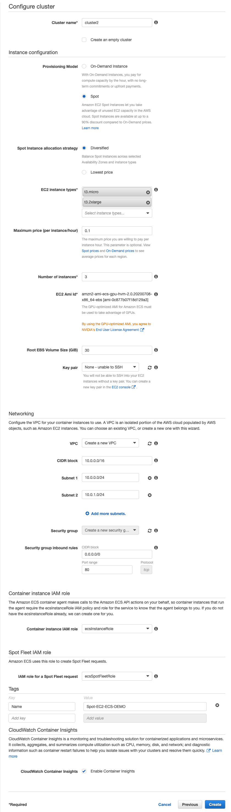

# Amazon ECS WorkShop

1. 利用 Cloud9 建立一個用於線上開發的環境，部署 ecs 服務  
2. LAB 練習區域限定於 us-east-1 (維吉尼亞)

## 建立 IAM 使用者金鑰

建立 Admin AccessKey 用於本次環境，減少權限問題，實務上用完務必刪除或按照最小權限原則處理

## 建立 Amazon Cloud9 開發環境

- [ ] 選擇 Ubuntu 主機，開機過程約 3 分鐘
- [ ] 關閉預設 `credentials`
- [ ] 設定字型大小便於使用
- [ ] 設定 `aws configure`
- [ ] 區域填入`us-east-1`
- [ ] 測試 `aws cli`

## Amazon Cloud9 開發環境安裝 Zsh (選擇性，不強制)

```bash
# https://github.com/ohmyzsh/ohmyzsh

sudo apt install zsh -y ; sh -c "$(curl -fsSL https://raw.githubusercontent.com/ohmyzsh/ohmyzsh/master/tools/install.sh)"

# 設定命令完成套件，編輯.zshrc
plugins=(git docker docker-compose aws)

# 設定完成後，重新開一個終端機視窗

```

## 建立 Amazon ECR Repositories

- [ ] GUI 方式建立
- [ ] 也可使用 aws cli 建立 `aws ecr create-repository --repository-name demo`
- [ ] registryId 每個帳號 ID 不同

```bash

aws ecr create-repository --repository-name demo
{
    "repository": {
        "repositoryArn": "arn:aws:ecr:us-east-1:674636563715:repository/demo",
        "registryId": "674636563715",
        "repositoryName": "demo",
        "repositoryUri": "674636563715.dkr.ecr.us-east-1.amazonaws.com/demo",
        "createdAt": 1594711027.0,
        "imageTagMutability": "MUTABLE",
        "imageScanningConfiguration": {
            "scanOnPush": false
        }
    }
}

```

## Docker Pull / Push 到剛剛建立的 Amazon ECR Repositories

```bash
# docker 基本的指令
# 拉取 docker images
docker pull amazon/amazon-ecs-sample:latest
docker pull ckmates/httpd:v1

# 以下的設定每個帳號 ID 不同，不可照抄！
#
# Amazon ECR 操作指令
# 重新命名 docker images tag
docker tag demo:latest 674636563715.dkr.ecr.us-east-1.amazonaws.com/demo:latest

# 取得 Amazon ECR 登入憑證 
aws ecr get-login-password --region us-east-1 | docker login --username AWS --password-stdin 674636563715.dkr.ecr.us-east-1.amazonaws.com

# 推送至 Amazon ECR
docker push 674636563715.dkr.ecr.us-east-1.amazonaws.com/demo:latest
```

## 建立 Amazon ECS Fargate Cluster 

- 建立 Cluster (Fargate) 使用 AWS Sample App 建立，會建構一些必要的 IAM Role 便於使用

## 建立 Task Definitions

- first-run-task-definition.json 引入
- JSON 檔內的帳號 ID 需要自行調整成自己的帳號 ID
- `"arn:aws:iam::674636563715:role/ecsTaskExecutionRole"`

## Run Task

使用 AWS Sample App 跑起來的環境做教學說明

---

## 建立 Amazon ECS with EC2 Cluster

- 部署模型使用 EC2 Linux + Networking  


- 設定細節參考  


- 執行並建立 EC2 Linux Cluster


- task-def-wordpress.json 引入
- JSON 檔內的帳號 ID 需要自行調整成自己的帳號 ID
- `"arn:aws:iam::674636563715:role/ecsTaskExecutionRole"`

---

# 限制

- [x] 使用 Linux 容器只能在 Linux 上的叢集運作
- [x] 使用 Windows 容器也只能在 EC2 上運作，Fargate 不支援 Windows 容器

