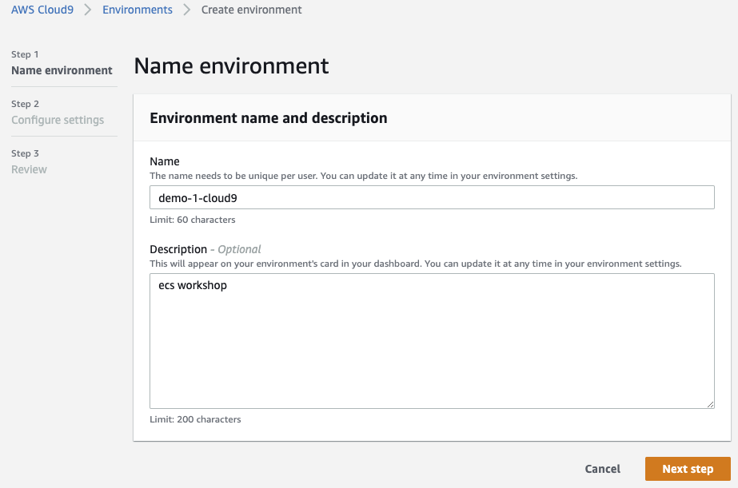
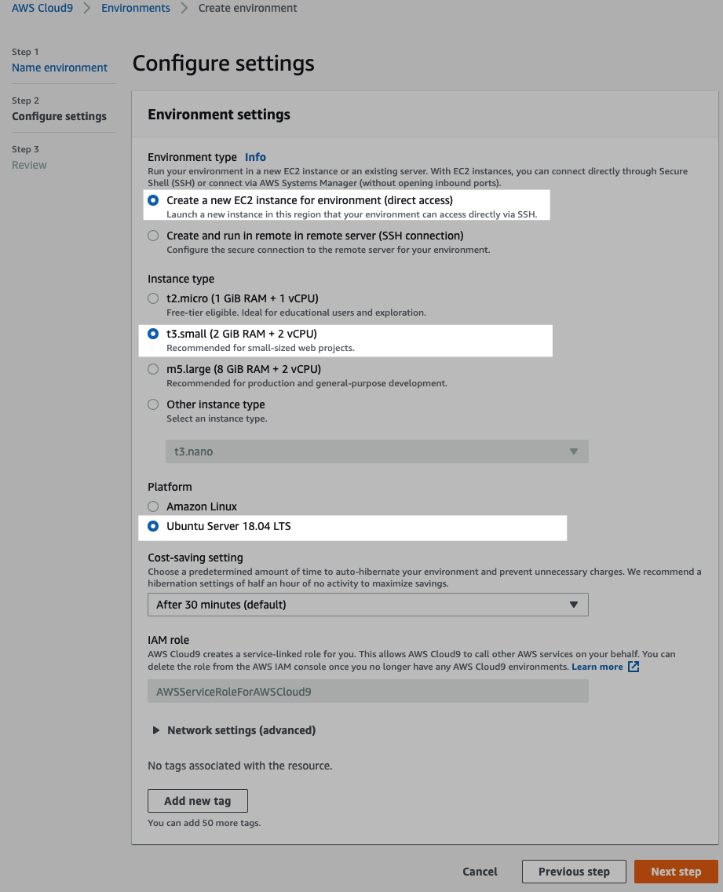
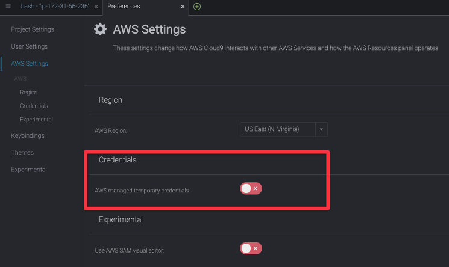
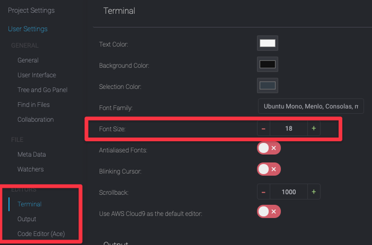
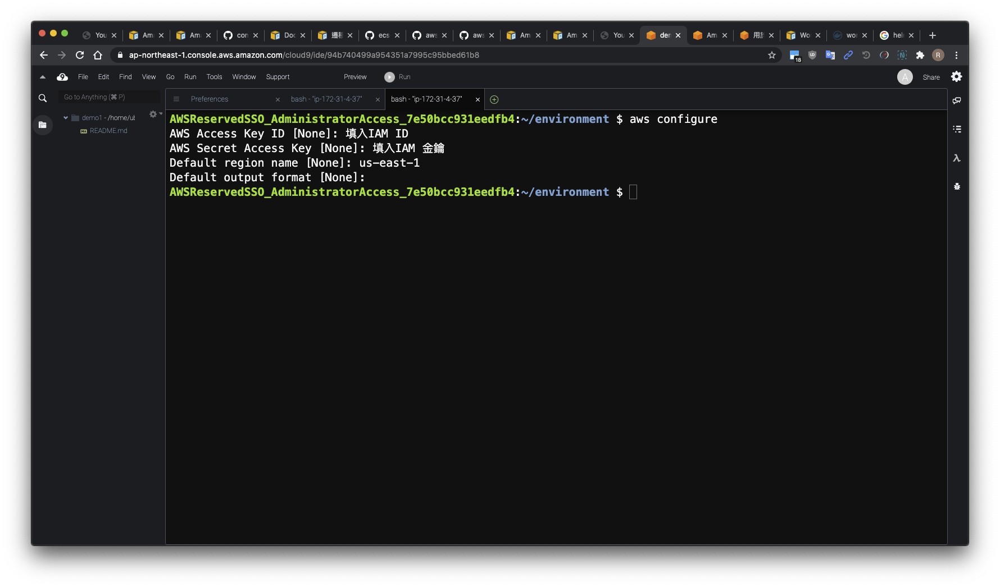
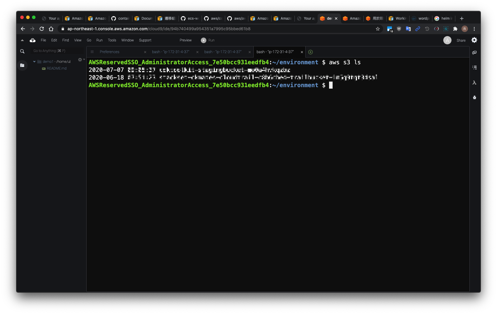

# Lab1

## 建立 IAM 使用者金鑰

- [ ] 建立 Admin AccessKey 用於本次 Lab 環境，減少權限問題，實務上用完務必刪除或按照最小權限原則處理
- [ ] 拷貝金鑰後妥善保存

## 建立與設定 Amazon Cloud9 開發環境

- [ ] 選擇 Ubuntu 主機，開機過程約 3~5 分鐘  
  
  

- [ ] 關閉 cloud9 預設 `credentials`  

- [ ] 設定 cloud9 字型大小便於閱讀及使用  



- [ ] 開機完畢後，在 `cloud 9 terminal` 介面輸入 `aws configure`  
- [ ] Default Region Name 填入`us-east-1`  
  
- [ ] 測試 `aws cli` 是否正常？ 可用基礎指令驗證 `aws s3 ls`  


## Amazon Cloud9 開發環境安裝 Zsh ( optional )

```bash
# https://github.com/ohmyzsh/ohmyzsh

sudo apt install zsh -y ; sh -c "$(curl -fsSL https://raw.githubusercontent.com/ohmyzsh/ohmyzsh/master/tools/install.sh)"

# 設定命令完成套件，編輯.zshrc
plugins=(git docker docker-compose aws)

# 設定完成後，重新開一個終端機視窗

```
