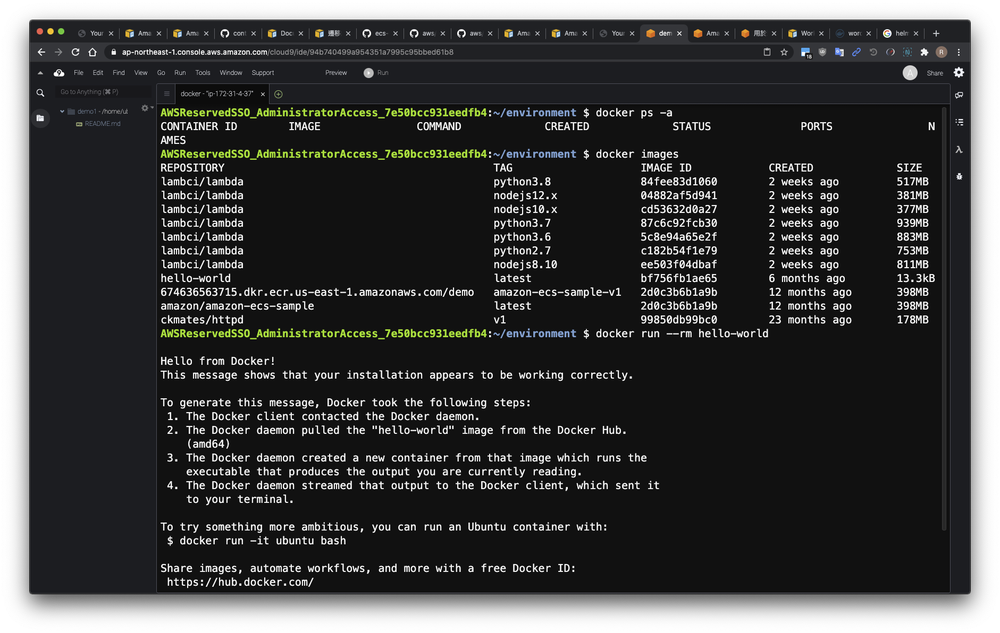
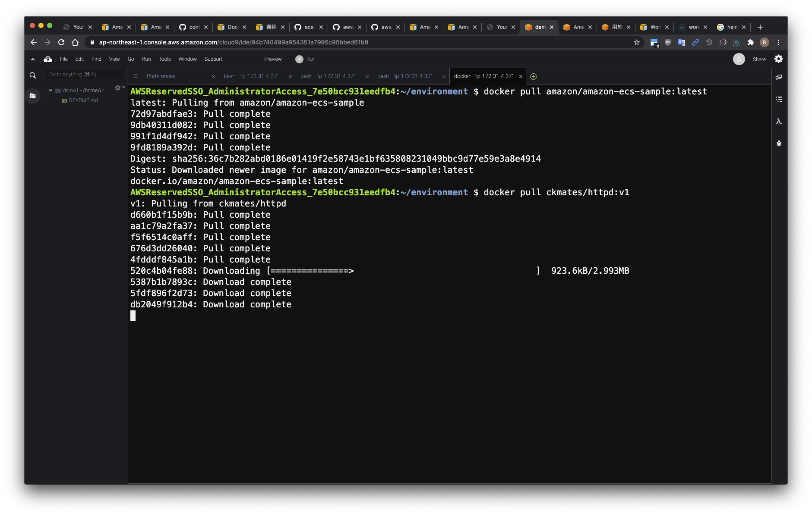
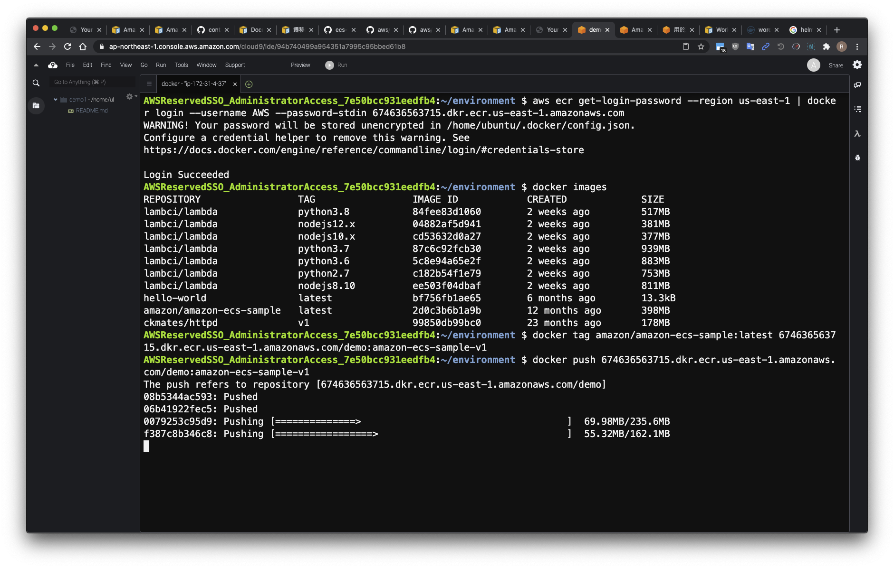
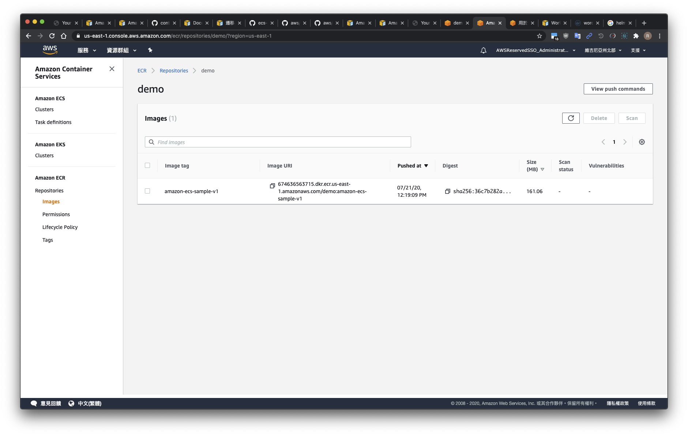

# Lab2

## 建立 Amazon ECR Repositories

- [ ] 使用 AWS Console 方式建立
- [ ] 複製自己帳號專屬的 `ecr push` 指令到記事本

## 測試 docker 指令

- [ ] 依序輸入以下指令測試運作狀態

```bash
# 檢查容器狀態
docker ps -a

# 列出目前本機具備的 docker images
docker images

# 測試 docker 運行狀態
docker run --rm hello-world
```



## Docker pull images

```bash
# docker 基本指令

# 提取 docker image
docker pull amazon/amazon-ecs-sample:latest

# 也可以在提取 ckmates 的 docker image (optional)
docker pull ckmates/httpd:v1
```



## Docker tag / push to Amazon ECR Repositories

以下的設定每個帳號 ID 不同，請適當的修改成自己的帳號環境，以下指令僅供參考

```bash
# Amazon ECR 指令
# 登入 Amazon ECR
aws ecr get-login-password --region us-east-1 | docker login --username AWS --password-stdin 674636563715.dkr.ecr.us-east-1.amazonaws.com

# 列出目前本機具備的 docker images
docker images

# 重新命名 docker images tag
docker tag amazon/amazon-ecs-sample:latest 674636563715.dkr.ecr.us-east-1.amazonaws.com/demo:amazon-ecs-sample-v1

# 推送至 Amazon ECR
docker push 674636563715.dkr.ecr.us-east-1.amazonaws.com/demo:amazon-ecs-sample-v1

```

  

可以在 AWS Console 查看推送後的 images  

