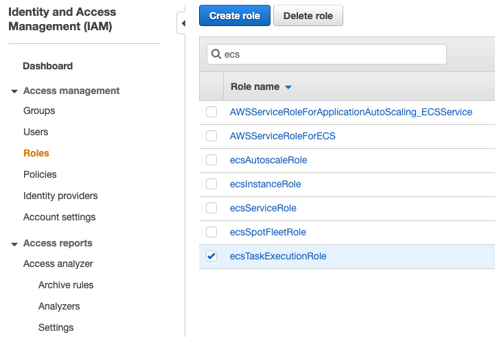

# Lab3

## 建立 Amazon ECS Fargate Cluster

- 使用 AWS Sample App nginx 建立 Cluster，此過程會建構一些必要的 IAM Role 便於使用  

- 建立完成後，可以在 `EC2 介面查看 LoadBalancer DNS name`

## Fargate Services Scale out

調整剛剛建立好的 `Service: nginx-service` 觀察 cluster 的運作狀態
