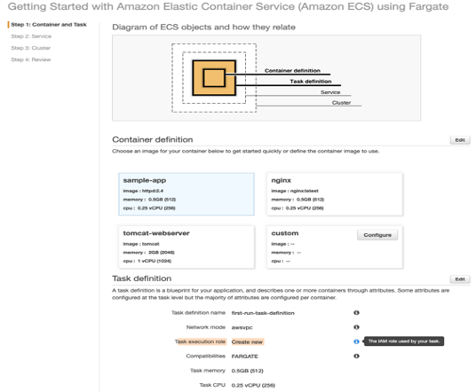
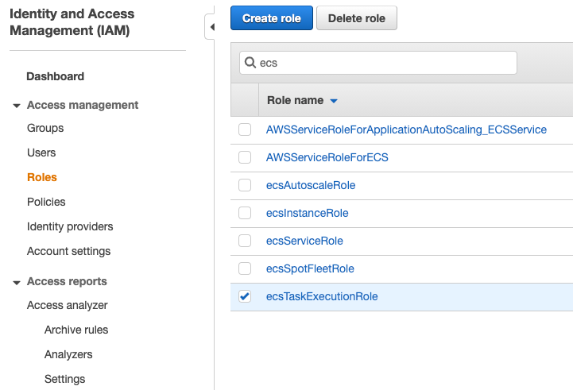
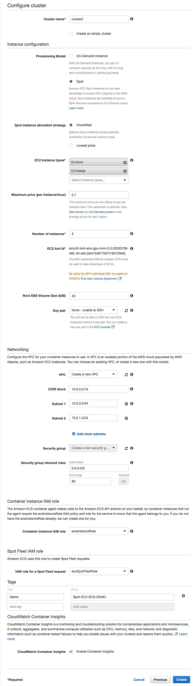

# Lab3

## 建立 Amazon ECS Fargate Cluster 

- 建立 Cluster (Fargate) 使用 AWS Sample App 建立，會建構一些必要的 IAM Role 便於使用  
  

### 建立 Task Definitions

- first-run-task-definition.json 引入
- JSON 檔內的帳號 ID 需要自行調整成自己的帳號 ID
- `"arn:aws:iam::674636563715:role/ecsTaskExecutionRole"`

### Run Task

使用 AWS Sample App 跑起來的環境做教學說明

## 建立 Amazon ECS with EC2 Cluster

- 部署模型使用 EC2 Linux + Networking  

- 設定細節參考  

- 執行並建立 EC2 Linux Cluster  

- task-def-wordpress.json 引入
- JSON 檔內的帳號 ID 需要自行調整成自己的帳號 ID
- `"arn:aws:iam::674636563715:role/ecsTaskExecutionRole"`
