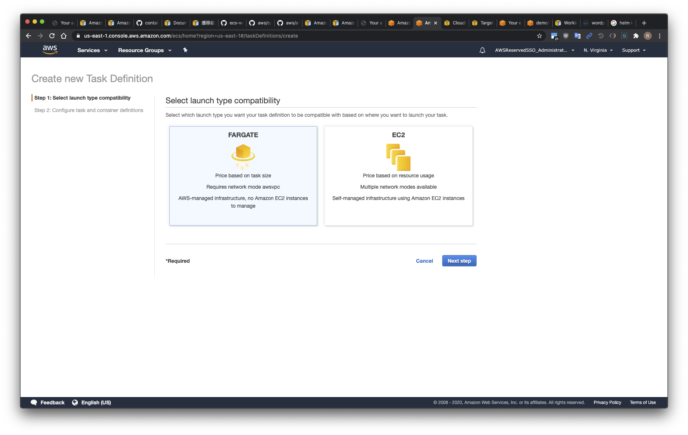
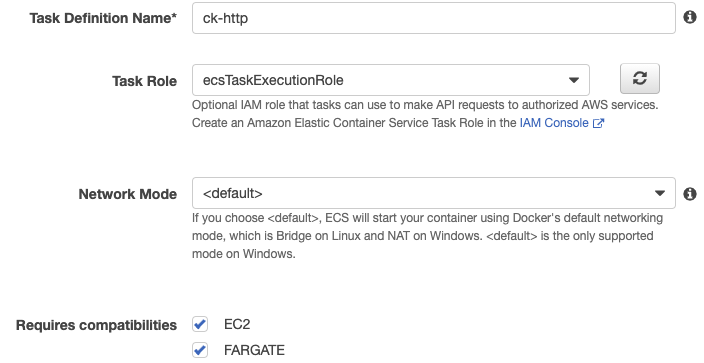

# Lab4

## 建立 Task Definitions

- 
- 使用 `json檔案` 引入
  - JSON 檔內的帳號 ID 需要自行調整成自己的帳號 ID，否則會失敗
  - `"arn:aws:iam::674636563715:role/ecsTaskExecutionRole"`

## Task Definitions compatibilities

- Requires compatibilities  

## Run Task

- 利用建立好的 task definitions 跑一個 task
  1. fg-task-def-ck-httpd-v1.json 適用於 fargate cluster
  2. ec2-task-def-wordpress.json 適用於 ec2-linux cluster
